# Providing a good Developer Experience for JavaScript Hardware

---


---

# My Name is Francis Gulotta


---


---

# `@reconbot`


---
# I work at Bocoup


---

#Open Design & Technology Services
#for People Creating the Future


---

# Open Design & Technology Services
# by people who helped build and improve the open source libraries and tools you're already using like v8, grunt, ember, jquery, d3, johnny-five, jshint, wordpress and so much more.


---

I work on

 - [Node SerialPort](https://github.com/voodootikigod/node-serialport/) (and Web SerialPort W3C)
 - [Johnny-Five](http://johnny-five.io/)
 - [Tessel 2](https://tessel.io/)

???

- Node SerialPort provides serial port access to over 25 platforms across versions of node, operating systems and on all sorts of cpus
- it's in the top 1-2% of all npm packages

---


???

Johnny Five provides a javascript hardware abstraction layer and device drivers. Meaning you can write an app once an use it anywhere.

---

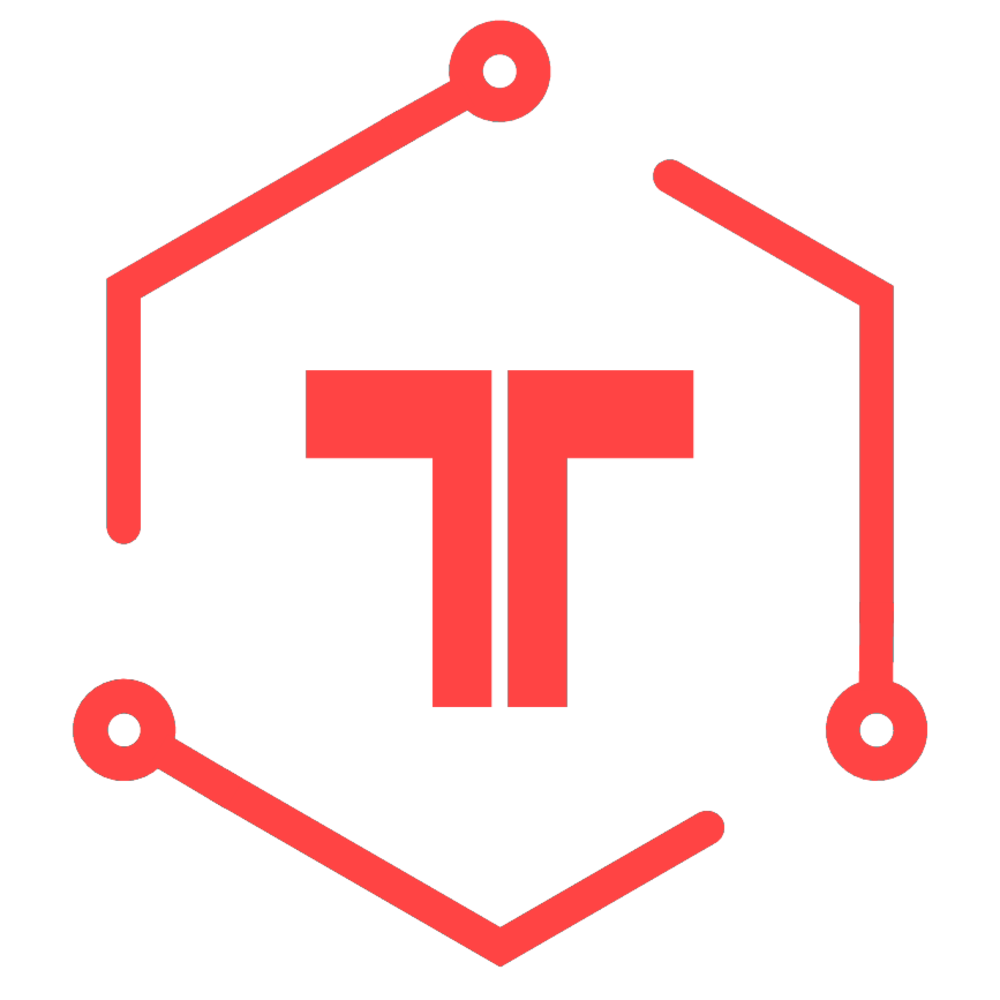

---


???

Tessel provides the best user experience for deploying, managing and running your JS code on a single board computer. Soon Rust!

---

???

Sorry that's a lot about me, but you should know who I am because I'm going to ask you to believe me

---

# We need a good developer experience for JavaScript Hardware.

???

because

---

# `C++` is horrible

---

```c++
void EIO_Open(uv_work_t* req) {
  OpenBaton* data = static_cast<OpenBaton*>(req->data);

  char originalPath[1024];
  strncpy_s(originalPath, sizeof(originalPath), data->path, _TRUNCATE);
  // data->path is char[1024] but on Windows it has the form "COMx\0" or "COMxx\0"
  // We want to prepend "\\\\.\\" to it before we call CreateFile
  strncpy(data->path + 20, data->path, 10);
  strncpy(data->path, "\\\\.\\", 4);
  strncpy(data->path + 4, data->path + 20, 10);

  int shareMode = FILE_SHARE_READ | FILE_SHARE_WRITE;
  if (data->lock) {
    shareMode = 0;
  }

  HANDLE file = CreateFile(
    data->path,
    GENERIC_READ | GENERIC_WRITE,
    shareMode,
    // dwShareMode 0 Prevents other processes from opening if they request
    // delete, read, or write access
    NULL,
    OPEN_EXISTING,
    FILE_FLAG_OVERLAPPED,
    // allows for reading and writing at the same time and sets the handle for asynchronous I/O
    NULL
  );
```
???

look at this horrible `c++` I wrote

---
# `C++`

- hard to learn
- hard to write
- hard to not make mistakes
- really hard to work online

???

remember heartbleed?

---

# Rust

.middle[]

???

- I'm enjoying learning rust
- I've learned more in a few weekends more than the 10 years of c++
- C is 44 years old
- C++ is 33 years old
- Not a fair comparison

---

.middle[
> "`C++` is a horrible language."
--Linus Torvald Out of Context
]

???

He actually likes C but that's horrible too

---

# We need a good developer experience for JavaScript Hardware.

???

I didn't answer your question, lets try again

---

# Firmware is C++

???

actually it's assembly

---

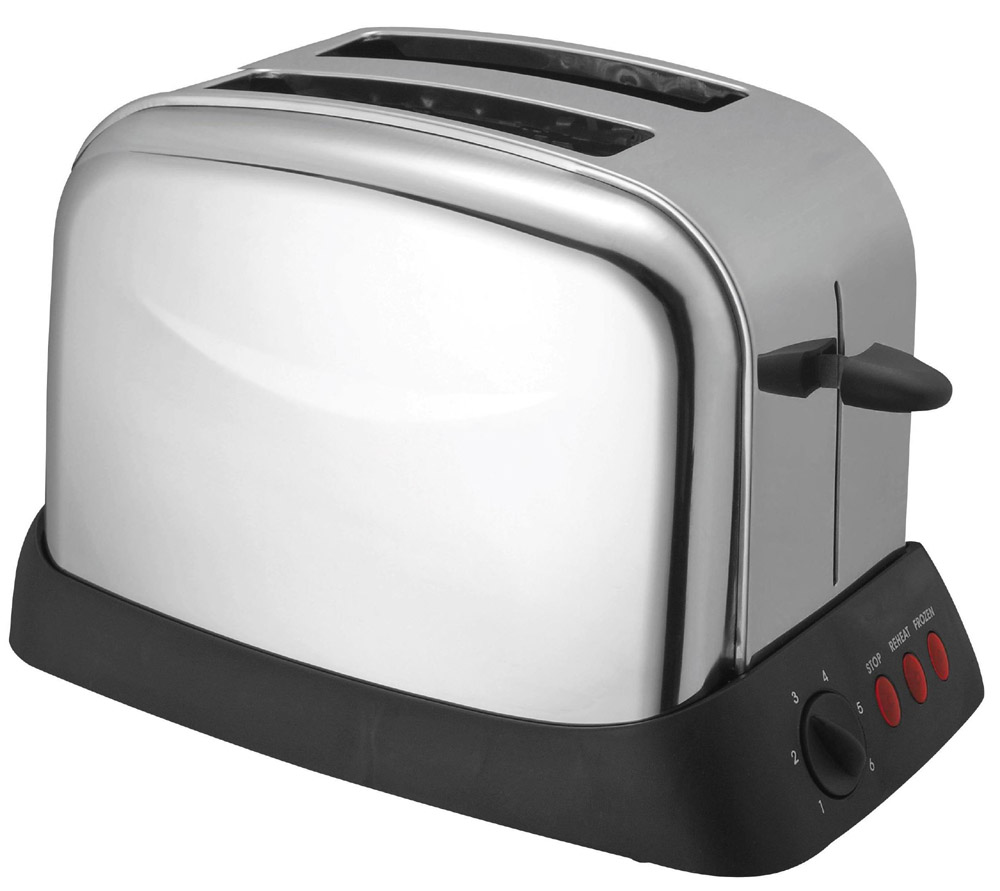

???

and it's everywhere

---

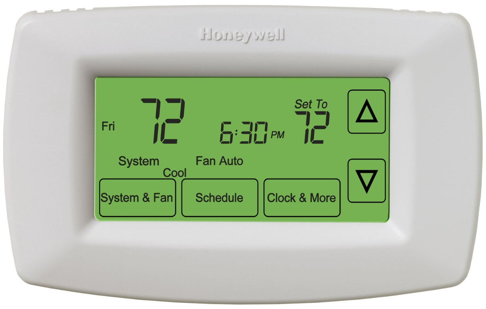

---


---

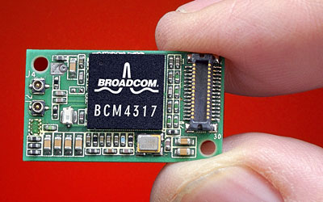

???

In anything with wifi

---

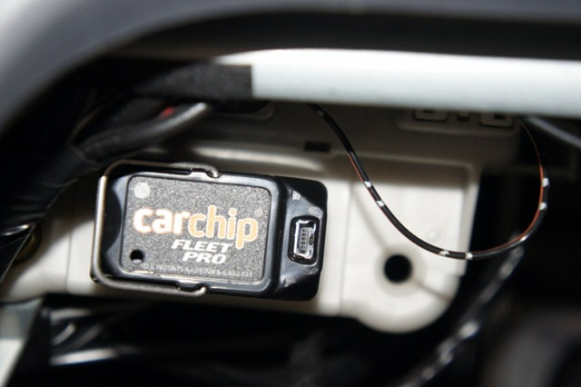

???

in your car

---


---

# We need a good developer experience for JavaScript Hardware.

???

Still don't know why

---

# Every device company wants to be an IoT company.

---

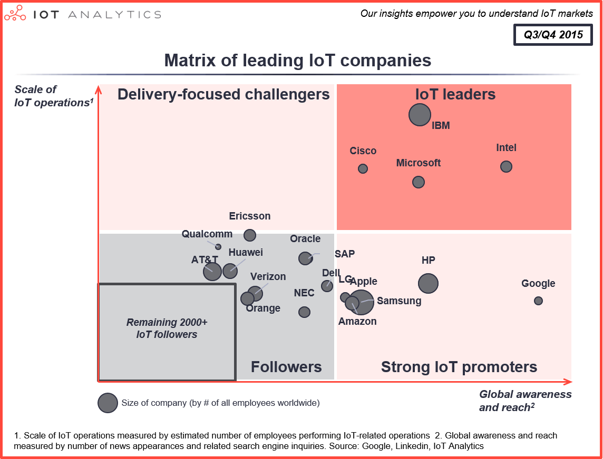

???

for one reason

---

# A device is one sale

---

# A web service is infinity sales

---

# Devices + Web = IoT

???

Every device manufacturer wants to be "web"

---

# `C++` + WEB = IoT


---

# `C++` is horrible

???

Yeah but I'll need some evidence

---

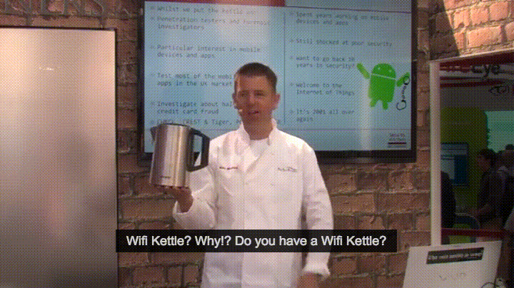

???

Researchers at an infosec conference discover simple already solved bugs in IoT devices

---

> "It's like going back to the year 2000 ... Everything is the wild west of security"
-- "Pen Test Partners" @ Infosecurity Europe 2015

---

> "Manufactures of these *things* don't get security."
-- "Pen Test Partners" @ Infosecurity Europe 2015

???

https://www.youtube.com/watch?v=GDy9Nvcw4O4

---

> They're shoehorning "WEB" into existing device firmware
-- Francis

---
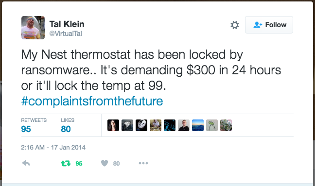

???

https://twitter.com/VirtualTal/status/424077709598146560

---

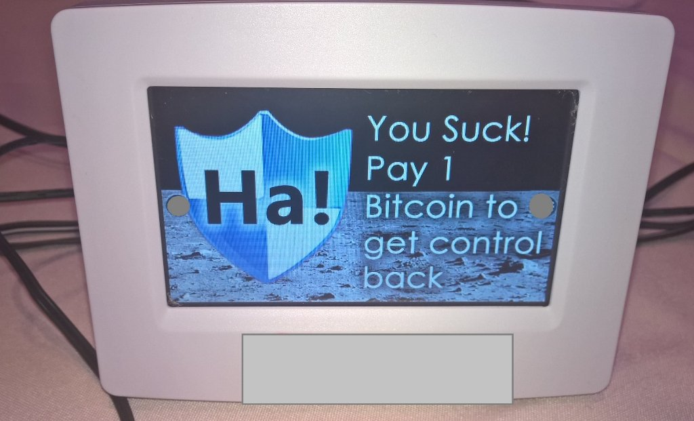

???

Defcon 2016 http://motherboard.vice.com/read/internet-of-things-ransomware-smart-thermostat

???

also the nest has been hacked! Takes 15 seconds http://www.forbes.com/sites/aarontilley/2015/03/06/nest-thermostat-hack-home-network/#5a23729e5cb0 http://www.computerworld.com/article/2476599/cybercrime-hacking/black-hat-nest-thermostat-turned-into-a-smart-spy-in-15-seconds.html

---

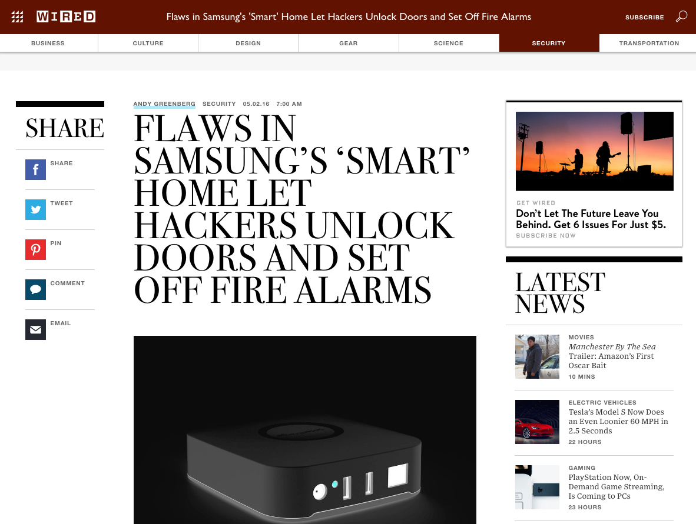

???

https://www.wired.com/2016/05/flaws-samsungs-smart-home-let-hackers-unlock-doors-set-off-fire-alarms/

---

# Wired magazine keeps calling it like it is :+1:

---


???

public ip address on the Internet, with easy to exploit c++ services
???

https://www.wired.com/2015/07/hackers-remotely-kill-jeep-highway/

---

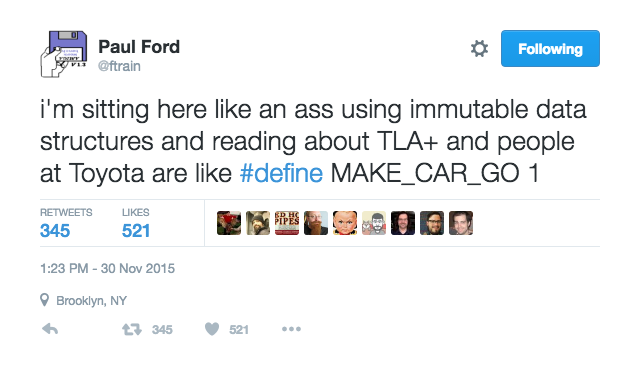

???

https://twitter.com/ftrain/status/671394222218592256

---


---


---

# WHY?

---

# `C++`

---

# `C++` and ...

---

# A development environment that works great in isolation doesn't work great on the web.

---

> "If copying a string is a dangerous operation in C++, then complaining on twitter using C++ is programmer negligence.""
-- Francis Gulotta

---

# We need a good developer experience for JavaScript Hardware.

---

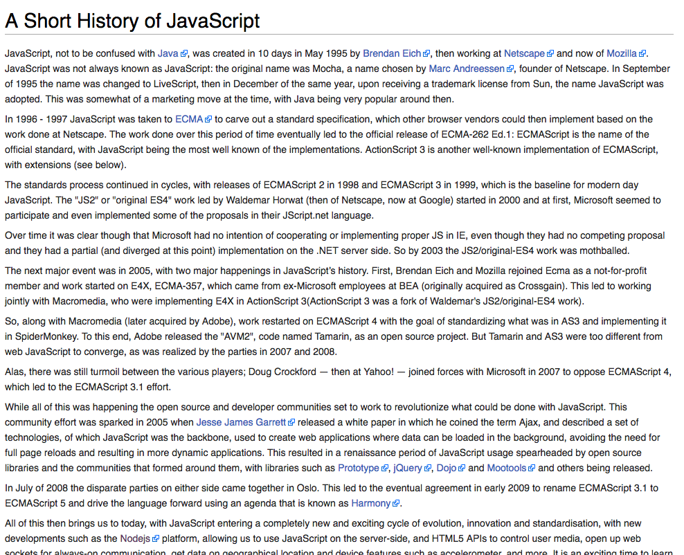

???

JavaScript was born on the web

---

# JavaScript

 - Easy to learn
 - Easy to write
 - Easy to work online
 - Easy to share the work of others

---

# Easy to run on hardware

---

# Easy to control your hardware

---

# Intel gets it

???

https://twitter.com/intel/status/734509277977530368

---


???

https://ostroproject.org/documentation/howtos/app-dev-nodejs.html

---

# Intel
Worked with the V8 team to ensure NodeJS runs on the Intel Edison and Joule platforms

Worked with the Johnny-Five team to ensure device compatibility with all their new devices and distributes Johnny-Five in their getting started guides.

---

# Jibo gets it

---


---

# Jibo
Integrates with the atom editor to let you produce animations and develop "skills" in JavaScript for use through the Jibo robot interface.

???

Jibo.com

---

# Silk Labs gets it

---


???

Take a smart phone, remove the screen, keep the camera and run nodejs and you get the sense

---

# Silk Labs

The "Sense camera and hub" provides JavaScript APIs for computer vision, advanced hearing, and deep learning libraries to mix with your standard NPM modules and run them to control your house from your house.

Not from the cloud.

???

http://www.silklabs.com/

---

# You can get it too

---


???

A world wide educational community around teaching JavaScript and electronics

---

# Johnny Five Inventors Kit (J5IK)

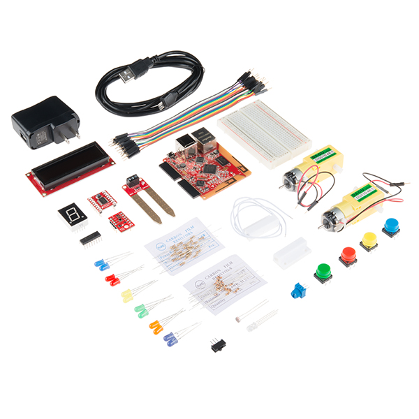

???

https://www.sparkfun.com/products/13847


---


---

# What's next?

---

# Most hacks are due to Poor Network and API access control

---

# Most hacks are concerning pairing a device with a phone

---

# Help me start `J5-Connect`

---

# Want to know which hardware has the best user experience?

---
# WCD Review

My team at Bocoup reviewed popular Single Board Computers

And rated them on ease of setup, quality of documentation, and flexibility of development workflow.

---

# Check out the Bocoup Web Connected Devices Review


http://wcd-review.bocoup.com

---

# Let me know what you think

Francis@bocoup.com

@reconbot


# Thank you!
